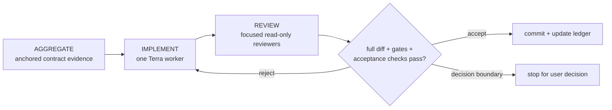
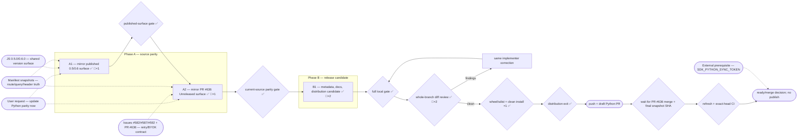

# Python SDK JavaScript-Parity — Goal-Driven Implementation Plan

Sources: user request to perform parity now; canonical `@tyxter/sdk-js` 0.5.0/0.6.0
changelogs; messaging issues #582, #587, and #592; messaging draft PR #636; public API
manifest and query snapshots
Written: 2026-08-10
Approved: 2026-08-10 — user message “approved. execute it”

## 0. Execution contract

### Roles

- Main Codex session: orchestrator and reviewer (`gpt-5.6-sol` / `max`). It plans,
  dispatches, verifies, updates this ledger, and commits. It does not edit SDK product source.
- Section implementer: exactly one bounded worker at a time, requested as
  `gpt-5.6-terra` / `xhigh`. It writes only the active section, does not commit, and does not
  spawn subagents.
- Explorers and focused reviewers are read-only and may run in parallel.
- Work executes in the isolated global worktree
  `C:/Users/DiegoPC/.config/superpowers/worktrees/tyxter-python/sdk-js-parity` on
  `codex/sdk-js-parity`. The clean main checkout and the old clean
  `codex/issue-625-sdk-0.6.0` worktree remain untouched.

### Model routing

- Orchestrator: `gpt-5.6-sol` / `max`.
- Implementer: direct built-in worker fallback, `gpt-5.6-terra` / `xhigh`, bounded
  `fork_turns: "none"`, because the registered `goal-implementer-terra` role is not exposed by
  this collaboration surface.
- Explorer: built-in explorer, `gpt-5.6-terra` / `medium`.
- Reviewer: read-only worker, `gpt-5.6-terra` / `high`.
- Before the first product edit, run the required bounded read-only routing preflight and record
  accepted role plus available model/effort evidence. Stop if the Terra route cannot be selected.

### Global gate

```powershell
uv sync --locked --extra dev
uv run --locked ruff format --check .
uv run --locked ruff check .
uv run --locked mypy
uv run --locked pytest -q
```

Baseline result, 2026-08-10: all commands exited 0; 81 files were already formatted, Ruff was
clean, strict mypy found no issues in 81 source files, and 71 tests passed.

### Pre-ruled contract decisions

| Decision            | Ruling                                                                                     | Reason                                                                                                                                                                                                                 |
| ------------------- | ------------------------------------------------------------------------------------------ | ---------------------------------------------------------------------------------------------------------------------------------------------------------------------------------------------------------------------- |
| Parity target       | Mirror published JS 0.5.0/0.6.0 plus the additive Unreleased contract in messaging PR #636 | This makes Python source match the canonical JS source that issues #582/#587/#592 depend on.                                                                                                                           |
| Version             | Prepare Python source at 0.6.0; record PR #636-only additions under Unreleased             | Both SDK source trees may contain Unreleased additions while retaining the last published version. No 0.6.0 Python artifact exists yet.                                                                                |
| Wire behavior       | Add typed wrappers only; do not change the REST/OpenAPI contract                           | The canonical API owns the behavior. Python must serialize the same paths, query names, bodies, and supported/required headers.                                                                                        |
| Snapshot provenance | Copy exact generated snapshots, never hand-edit individual rows                            | The first accepted section pinned messaging main `39afdf4e`; PR #636 was provisionally refreshed after main integration to `a426da83`. Refresh to the eventual merged canonical SHA before making the Python PR ready. |
| Publication         | No tag, workflow dispatch, PyPI upload, or merge in this execution                         | Publication is immutable external state and PR #636 is not yet merged. This pass produces a reviewed draft candidate.                                                                                                  |
| Sync credential     | Treat `SDK_PYTHON_SYNC_TOKEN` as an external release prerequisite                          | The workflow is already correct but the secret is absent/invalid. Its credential cannot be invented or committed.                                                                                                      |

### Expensive or mutating lifecycle gate budget

| Gate                                      | Consumes / invalidated by                |                                           Planned runs | Why this count is safe                                                                           |
| ----------------------------------------- | ---------------------------------------- | -----------------------------------------------------: | ------------------------------------------------------------------------------------------------ |
| Canonical snapshot sync                   | Messaging main, then PR #636/final merge | 2 local + 1 final refresh if merge SHA/content changes | Two sections need independently green route gates; the final refresh proves merged provenance.   |
| Full Python gate                          | Each accepted section/correction         |         1 baseline + 1 per accepted section/correction | Cheap and local; required before every section acceptance.                                       |
| Wheel/sdist build and clean-install audit | Final source, version, package metadata  |                                                      1 | Run only after all source/review corrections to avoid invalidated artifacts.                     |
| Branch push and draft PR                  | Accepted commits                         |                1 initial + 1 final refresh if required | The first publishes the review candidate; a later push is reserved for merged-source provenance. |
| PyPI publication                          | Final tag on main                        |                                                      0 | Explicitly outside this execution.                                                               |
| GitHub secret mutation                    | Human-supplied cross-repo credential     |                                                      0 | No credential is available or authorized for storage.                                            |

Execution note: the repository's ordinary `pytest` suite contains an isolated temporary archive
build in `tests/test_distribution.py`, so baseline/section gates exercised ephemeral builds before
the final review. The planned persistent `dist/` build, archive inspection, and clean-wheel install
still ran exactly once after the final whole-branch review; those generated artifacts were removed
after verification.

### Rules

- Implementation is sequential; never run two implementers concurrently.
- Preserve exact route/query/header behavior and public runtime compatibility.
- Do not weaken strict typing to generic JSON to make parity easier.
- Keep `InteractiveMessagePayload(...)` runtime-callable for existing users while adding precise
  `order_details` typing.
- `retry_transcription` must reject omitted or blank idempotency keys before network I/O.
- Do not modify messaging PR #636 or resolve its conflicts during this Python pass.
- Approval authorizes routine in-contract correction rounds. Stop only for an unapproved public
  shape, compatibility break, dependency, credential, publication, or trust-boundary decision.



## 1. Goals — observable definition of done

### Goal 1 — Python exposes the same supported public surface as canonical JavaScript

- [x] Python covers the same 171 SDK routes as canonical JS: 173 manifest rows less the shared
      two reviewed capability-token media blob exemptions.
- [x] Query parameters and all three idempotency modes (`unsupported`, `supported`, `required`)
      match the canonical snapshots; trace headers match exactly.
- [x] Published JS 0.5.0/0.6.0 additions are typed and documented: pacing/allowance/status reason,
      native Pix, account health, inbound media, media source/download, transcription, and typing.
- [x] Existing button/list interactive construction and every existing test remain compatible.

### Goal 2 — PR #636 additions are represented without claiming premature release

- [x] `messages.retry_transcription()` requires a nonblank idempotency key, forwards optional
      trace/language, and preserves stable API errors without spending a retry on client misuse.
- [x] Provider credential setup types represent `openai.stt` and its mutually exclusive completed
      response axis.
- [x] The changelog separates shipped 0.6.0 parity from PR #636-only Unreleased additions.
- [x] Draft Python PR #1 is reviewable but remains blocked from ready/merge/publication until PR
      #636 is canonical and the final snapshot provenance is refreshed.

### Goal 3 — The candidate is distributable and future drift is visible

- [x] Strict formatting, lint, typing, route conformance, behavior, and distribution tests pass.
- [x] One wheel/sdist build contains the intended code, types, README, license, and `py.typed`; a
      clean temporary environment imports the built wheel as version 0.6.0.
- [ ] The handoff names the unresolved `SDK_PYTHON_SYNC_TOKEN` prerequisite; no secret, tag, or
      registry state is mutated.

## 2. Topology graph and recommended order

### Topology graph



### Graph Findings

Resolved before approval:

- **Dropped source parity** — a route-only plan omitted JS 0.5/0.6 response and request types.
  A1 now mirrors the full changelog surface and adds typing/runtime tests.
- **Version ambiguity** — PR #636 additions are newer than published 0.6.0. B1 keeps source at
  0.6.0 while documenting those additions under Unreleased, matching the JS repository model.
- **Unruled compatibility floor** — precise Pix variants can accidentally replace the callable
  exported `InteractiveMessagePayload`. A1 explicitly preserves that runtime behavior.
- **False-green header gate** — Python currently treats only `supported` idempotency as a header
  obligation and cannot express `required`. A2 upgrades the conformance classifier and proves the
  existing feedback auto-key plus required retry key behavior.
- **Premature canonical provenance** — PR #636 is not merged. After main integration, the candidate
  provisionally pins the conflict-free head `a426da83` for local proof, but ready/merge stays behind
  a final canonical refresh.
- **External secret conflated with code** — `SDK_PYTHON_SYNC_TOKEN` is not a repository fix. It is
  represented as an explicit external release prerequisite with zero secret mutations here.

Accepted risks:

- **Provisional PR source** — PR #636 integration may alter generated snapshots. Mitigation: keep
  the Python PR draft and rerun snapshot/conformance/full gates against the eventual merge SHA.
- **Cross-language structural equivalence** — Python TypedDict idioms cannot mechanically mirror
  every TypeScript declaration. Mitigation: exact wire tests, strict type-corpus coverage, public
  exports, and runtime-constructor compatibility tests define equivalent behavior.

### Hard dependencies

- A1 precedes A2 because published 0.6.0 parity is the compatibility baseline for Unreleased
  additions.
- A2 precedes B1 because version/docs must describe the final source candidate.
- Whole-branch review precedes the one package build so corrections cannot invalidate artifact
  evidence.
- PR #636 merge and final snapshot refresh precede making the Python PR ready.

### Soft dependencies

- The external sync credential should be restored before a Python release, but it does not block
  local implementation or opening a draft PR.

### Recommended linear order

```text
A1 -> published-surface gate -> A2 -> current-source parity gate -> B1
-> full local gate -> whole-branch review -> wheel/sdist + clean install ×1
-> draft Python PR -> provisional PR #636 main-integration refresh -> wait for merge
-> final canonical refresh/CI -> handoff
```

## 3. Sections

## A1 — Mirror published JS 0.5.0/0.6.0 surface

GOAL:
Bring Python from its 0.4.0 contract to the complete published JS 0.6.0 surface without breaking
existing Python callers.

SOURCES:
JS changelog 0.5.0/0.6.0; messaging main `39afdf4e`; prior deferred Python A2 findings in the
messaging SDK 0.6.0 plan.

TARGET:
Python message/media/batch/phone/provider types, message/media resources and builders, public
exports, conformance artifacts, README, typing corpus, and focused behavior tests.

DEPENDS ON:
None.

IMPLEMENTER PROFILE:
Direct worker fallback, requested `gpt-5.6-terra` / `xhigh`, bounded fork.

CONTEXT TO AGGREGATE:

1. `src/tyxter/resources/{messages,media}.py`, `_base.py`, and `path_id()` conventions.
2. `src/tyxter/types/{messages,media,batches,phone_numbers,provider_connections}.py` and exports.
3. JS 0.5/0.6 contracts/resources/changelog and canonical API schemas.
4. Route conformance AST scanner, MockTransport wire tests, and strict typing corpus.

LIFECYCLE / GATE EFFECTS:

- Produces: published-surface SDK source, exact messaging-main conformance snapshots, tests/docs.
- Binding: Python source/package input.
- Consumed by: published-surface gate, A2, B1, final build.
- Invalidates prior evidence from: Python global gate.
- External mutation/repetition cost: none.

IMPLEMENT:

- Add request/retrieve transcription, typing, and media download methods with exact encoded paths
  and supported trace headers; add `media.list(source=...)` with canonical wire name.
- Add strict request/response types and exports for transcription, typing, media download/source,
  failed inbound media, inbound message media descriptors, message status reason, batch pacing,
  phone allowance, provider account health/restrictions, and optional Meta OAuth WABA selection.
- Close older truthful-source gaps included in canonical JS: provider connection
  `display_phone_number`/`suspension_reason`, optional OAuth `signup_session_id`, and structured
  WhatsApp phone recipients that serialize country calling code plus national number exactly.
- Add precise native Pix `order_details` request variants, exports, builder/resource serialization
  tests, and a concise README example. Preserve existing button/list behavior and callable
  `InteractiveMessagePayload(...)` construction.
- Copy exact main snapshots and SOURCE_COMMIT; never edit generated rows individually.

CONTRACT DECISION — ESCALATE:
Stop before replacing a public callable type with a non-callable alias, weakening payload typing to
generic JSON, changing runtime serialization, adding dependencies, or changing REST behavior.

VERIFY:

- Global gate from section 0.
- Focused resource/wire tests, route/query/header conformance, strict typing usage, and explicit
  runtime-constructor compatibility test.

REVIEW:
Contract/API compatibility, Python typing, wire fidelity, and scope/convention.

ACCEPTANCE:
Goal 1's published-surface clauses pass against messaging main `39afdf4e`.

COMMIT:
`feat(sdk): mirror JavaScript 0.6 public surface`

## A2 — Mirror PR #636 Unreleased retry and BYOK surface

GOAL:
Add the public retry command and STT credential-setup types from PR #636 while preserving the
idempotent replay and provider-cost safety contract.

SOURCES:
Messaging issues #582/#587/#592; draft PR #636 at `f03565b2`; JS Unreleased changelog and resource
tests; canonical OpenAPI error/header contract.

TARGET:
Python message resource/types, provider credential setup types, conformance classifier/artifacts,
README/changelog Unreleased notes, and focused tests.

DEPENDS ON:
A1 accepted.

IMPLEMENTER PROFILE:
Same direct Terra/xhigh worker used for A1 and any corrections.

CONTEXT TO AGGREGATE:

1. JS `messages.retryTranscription()` required-key validation and exact option/body forwarding.
2. Required retry error codes/statuses, including `Retry-After` pass-through through normal errors.
3. Provider setup `openai.stt` target and mutually exclusive completed response axes.
4. Python route-conformance handling of `unsupported`, `supported`, and `required` idempotency.

LIFECYCLE / GATE EFFECTS:

- Produces: current-source parity and exact provisional PR #636 snapshots/SOURCE_COMMIT.
- Binding: Python source/package input.
- Consumed by: current-source parity gate, B1, final build, draft PR.
- Invalidates prior evidence from: A1 global/conformance gate.
- External mutation/repetition cost: none; the provisional source SHA must be refreshed later.

IMPLEMENT:

- Add `messages.retry_transcription(message_id, payload, *, idempotency_key, trace_id=None)` with
  required nonblank local validation, encoded path, exact language body, and canonical response.
- Add `openai.stt`, `completed_stt_provider`, and response typing that makes completion axes mutually
  exclusive without regressing existing constructor/use patterns.
- Upgrade route conformance to prove all three idempotency modes, including feedback's existing
  generated required key and retry's caller-required key.
- Copy exact PR #636 snapshots and source SHA; document the retry command and Unreleased status.

CONTRACT DECISION — ESCALATE:
Stop before auto-generating retry keys, accepting blank keys, changing response/error semantics, or
claiming PR #636 is released/canonical.

VERIFY:

- Global gate from section 0.
- Focused retry validation/wire/replay-call tests, provider setup typing/runtime tests, and full
  route/query/header conformance.

REVIEW:
Idempotency/cost safety, contract parity, typing correctness, and provisional-source honesty.

ACCEPTANCE:
Goal 2 retry/provider clauses and Goal 1 full route/query/header clauses pass against `f03565b2`.

COMMIT:
`feat(messages): add explicit transcription retry`

## B1 — Prepare the non-publishing Python 0.6.0 candidate

GOAL:
Make the parity source reviewable and distributable without mutating a registry or claiming PR #636
has shipped.

SOURCES:
Shared version-line policy; Python publish workflow; JS changelog; accepted A1/A2 evidence.

TARGET:
`src/tyxter/_version.py`, CHANGELOG, README, distribution tests if needed, and this plan ledger.

DEPENDS ON:
A1 and A2 accepted.

IMPLEMENTER PROFILE:
Same direct Terra/xhigh worker used for prior sections and corrections.

CONTEXT TO AGGREGATE:

1. Hatch dynamic version and User-Agent behavior.
2. Keep-a-Changelog structure and shared version-line statement.
3. `tests/test_distribution.py`, `.github/workflows/ci.yml`, and `publish.yml` safety gates.
4. Existing package file allowlist, `py.typed`, and fresh-wheel import check.

LIFECYCLE / GATE EFFECTS:

- Produces: source version 0.6.0, accurate released/Unreleased notes, final package inputs.
- Binding: wheel/sdist build input.
- Consumed by: full gate, final review, one build/install audit, draft PR.
- Invalidates prior evidence from: global gate and any prior artifact build.
- External mutation/repetition cost: branch push/draft PR only; no tag, merge, or registry write.

IMPLEMENT:

- Set source version to 0.6.0 and add accurate 0.5/0.6 catch-up notes plus a distinct Unreleased
  section for retry/openai STT additions.
- Reconcile README examples and method inventory with the final Python surface.
- Do not alter release workflow security, dependencies, or publication channels.

CONTRACT DECISION — ESCALATE:
Stop before selecting a version other than the shared 0.6.0 source line, changing release workflow
trust, adding dependencies, tagging, publishing, or merging ahead of canonical PR #636.

VERIFY:

- Global gate from section 0.
- Whole-branch diff review after all section reviews are clean.
- One `uv build`, archive-content inspection, and fresh temporary-environment wheel install/import
  asserting `tyxter.__version__ == "0.6.0"` and representative new public types/resources.

REVIEW:
Release metadata, distribution integrity, docs accuracy, scope, and secret/artifact hygiene.

ACCEPTANCE:
Goal 3 local/distribution clauses pass and the branch is safe to push as a draft PR.

COMMIT:
`release(sdk): prepare Python 0.6 parity candidate`

## 4. Main-session acceptance protocol

Before accepting a section, the main session reads its full diff, confirms green gate evidence,
checks exact source provenance, verifies public compatibility and section-bounded scope, and
requires evidence-bearing focused reviews. Rejections return to the same implementer; affected
reviews and gates repeat until clean. The main session alone stages and commits accepted files plus
the updated ledger.

After B1, run whole-branch contract, typing, conformance, release, and scope reviews. Only then run
the one package build/install audit, push, and open a draft PR. Do not mark it ready, merge, tag, or
publish. After messaging PR #636 is integrated, refresh snapshots/SOURCE_COMMIT to the merged SHA,
rerun the full gate and exact-head CI, then return for a ready/merge decision.

## 5. Progress ledger

## Phase A — source parity

- [x] A1 Mirror published JS 0.5.0/0.6.0 surface — complete typed/runtime/wire parity against
      messaging main — routing: requested=worker/gpt-5.6-terra/xhigh; role=worker accepted via
      `/root/python_parity_implementer`; model/effort=runtime metadata unavailable;
      fallback=direct built-in worker — review round 1: REJECT (Pix tuple/body/header/footer
      precision; inbound-media discrimination; missing `redacted_at`; query snapshot byte copy) —
      correction round 1: APPROVE from contract and conformance reviewers; exact locked gate green
      (82 files formatted, Ruff clean, strict mypy clean, 75 tests); both snapshot hashes match
      canonical `39afdf4e` byte-for-byte.
- [x] A2 Mirror PR #636 Unreleased retry/BYOK surface — exact required-idempotency and provider
      typing parity — routing: requested=same worker/gpt-5.6-terra/xhigh; role=accepted preflight;
      model/effort=runtime metadata unavailable; fallback=direct built-in worker — review round 1:
      REJECT (blank explicit feedback key omitted the now-required header; AST proof lacked runtime
      coverage) — correction round 1: APPROVE from contract and conformance reviewers; exact locked
      gate green (82 files formatted, Ruff clean, strict mypy clean, 85 tests); PR #636 manifest and
      query hashes match `f03565b2` byte-for-byte.

## Phase B — release candidate

- [x] B1 Prepare non-publishing Python 0.6.0 candidate — docs/version/distribution are accurate —
      routing: requested=same worker/gpt-5.6-terra/xhigh; role=accepted preflight;
      model/effort=runtime metadata unavailable; fallback=direct built-in worker.
      Whole-branch review round 1: REJECT (precise setup-session result was not assignable to the
      legacy public response type; README install path could imply PyPI contains draft APIs;
      archive metadata lacked an exact 0.6.0 assertion). Correction round 1 resolved assignment,
      install, and archive findings, but whole-branch review round 2: REJECT because making legacy
      response fields `ReadOnly` broke prior statically typed mutation. Correction round 2:
      APPROVE from contract, conformance, and release reviewers; non-build gate green (82 files
      formatted, Ruff clean, strict mypy clean, 86 tests excluding the archive builder); one final
      `uv build` produced 0.6.0 wheel/sdist, archive inspection passed, and a fresh Python 3.13
      environment imported version 0.6.0 plus representative parity resources.

## Provisional provenance follow-up

- Draft Python PR #1 is open. CI for Python 3.10, 3.11, 3.12, and 3.13 is green at the prior
  Python head `2b52318`.
- PR #636 completed main integration and is conflict-free/mergeable at provisional head
  `a426da83f21ced4c49d666d310874850d1629e8e`. Both vendored conformance JSON files match that
  head byte-for-byte, and `conformance/SOURCE_COMMIT` now records it.
- This is provisional evidence only. Making Python PR #1 ready still waits for PR #636 to merge,
  followed by the final canonical snapshot/SOURCE_COMMIT refresh and exact-head CI.
- Provisional refresh gate: locked Ruff format/check and strict mypy passed for 82 files, route
  conformance passed 6 tests, the full suite passed 87 tests, and `git diff --check` was clean.
- No merge, tag, workflow dispatch, or PyPI publication occurred during this execution.

## Completion

- [x] Every accepted section and ledger update is committed.
- [x] Goals 1–3 local exit tests pass with exact command evidence.
- [x] Whole-branch final review is clean before the single artifact build.
- [x] Wheel/sdist and clean-install audit pass once on final source.
- [x] Branch is pushed and draft Python PR #1 is open; CI is green for Python 3.10–3.13 at
      `2b52318`; no merge/tag/PyPI mutation occurred.
- [x] PR #636 main-integration/provisional provenance refresh is complete at `a426da83`.
- [ ] PR #636 merge, final canonical refresh, and exact-head CI remain explicit ready/merge gates.
- [ ] Missing `SDK_PYTHON_SYNC_TOKEN` remains an explicit external release prerequisite.
- [ ] Topology graph is annotated as executed and re-rendered.
- [ ] Requested routes, accepted roles, model/effort evidence, fallbacks, and deferrals are reported.
