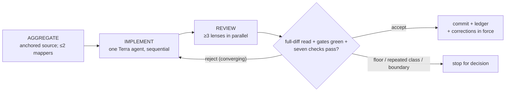
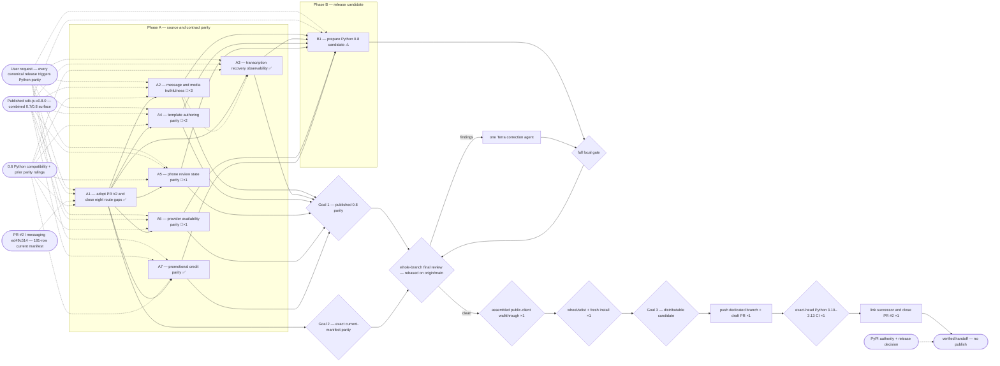

# Python SDK 0.8 Parity — Goal-Driven Implementation Plan

Sources: user parity request (2026-09-03); Python PR #2; published `@tyxter/sdk-js` 0.8.0;
canonical `sdk-js-v0.6.0..sdk-js-v0.8.0`; Tyxter Messaging main
`ed49c514b74a59de3b238d4ebc157f20482b6171`; `AGENTS.md`; and
`docs/plans/2026-08-10-sdk-js-parity.md`
Written: 2026-09-03

## Premise corrections

Input claims verified against the Python tree, the canonical checkout, the published package, and
PR #2 before this review:

- **“Continue from PR #2” does not mean implement on its branch.** The messaging workflow declares
  `sync/api-manifest` long-lived and force-updates it with `git checkout -B` and `git push --force`
  (`../tyxter-messaging/.github/workflows/sync-python-sdk-manifest.yml:100`). The plan consumes the
  PR's exact artifacts on a dedicated branch and supersedes it only after replacement CI is green.
- **Published 0.8 parity and current manifest parity have different provenance.** The 0.8 tag has
  179 manifest rows; PR #2 pins 181 rows at `ed49c514...`. The two extra phone-renewal reads are
  implemented but documented under `Unreleased`, never attributed to the published tag.
- **There is no published 0.7 SDK tag.** `@tyxter/sdk-js` 0.8.0 is the first published artifact
  carrying both the canonical 0.7 and 0.8 changelog changes, so the inventory spans 0.6→0.8.
- **Repository and registry versions differ.** Python source is 0.6.0
  (`src/tyxter/_version.py:1`) while PyPI serves 0.4.0. This plan prepares a cumulative 0.8.0 source
  candidate; it does not claim or perform publication.

## 0. Execution contract

### Roles

- Main Codex session: orchestrator and reviewer; prefer `gpt-5.6-sol` at `max`. It plans,
  dispatches, verifies, updates this ledger, and commits. It never edits product source code.
- The main session is the sole orchestrator. No delegated Sol orchestrator is needed for these
  eight sequential sections.
- Section implementer: exactly one agent at a time. It writes code only for its active section,
  does not commit, and does not spawn subagents.
- Explorers and focused reviewers: read-only; may run in parallel within available agent slots.

### Harness routing

Harness: `codex` — resolved under the canonical v0.2.1 skill's
`references/routing-codex.md` preflight.

| Role | Requested | Role-confirmed | Model/effort-confirmed | Fallback used |
|---|---|---|---|---|
| Implementer | `goal-implementer-terra` / Terra / xhigh | yes — `gdi-implementer-terra-xhigh-v2` attestation | unconfirmed — runtime metadata unavailable | none |
| Mapper | `goal-explorer` / Terra / medium | no — registered role returned no attestation | unconfirmed | direct `default` with requested Terra/medium; runtime metadata unavailable |
| Reviewer | `goal-reviewer` / Terra / high | yes — `gdi-reviewer-v1` attestation | unconfirmed — runtime metadata unavailable | none |

The fallback mapper is read-only and cannot authorize implementation. If implementer or reviewer
role confirmation fails during execution, stop before product edits or acceptance respectively;
never inherit the Sol orchestrator route as an implicit fallback.

### Global gate

```bash
uv sync --locked --extra dev
uv run --locked ruff format --check .
uv run --locked ruff check .
uv run --locked mypy
uv run --locked pytest
```

Baseline result: 2026-09-03 at `332b21afa0dc890ef2e8f0cb70ef5ca7e9d1bdb6`; re-run in the managed
execution worktree exited 0 on every command, with 82 files formatted, Ruff clean, strict mypy
clean, and 87 tests passed on Python 3.14.6. A one-off mypy failure observed by the topology
reviewer was withdrawn after immediate clean reruns in both worktrees. The exact-head PR gate must
additionally pass the supported Python 3.10–3.13 matrix.

### Execution-environment preflight

Preflight status: ready
Checked: 2026-09-03
Baseline SHA: `d4ed951243086db658276bd4950a4ea62ea037d7` (approved-plan activation base; product source remains at `332b21a`)
Execution realm: HubGrid-managed worktree on local branch `codex/sdk-js-0.8-parity`

| Capability | Probe / expected condition | Observed evidence | Classification |
|---|---|---|---|
| Worktree and branch | Dedicated clean branch; automation branch untouched; approved plan present before dispatch | Approved plan committed as `d4ed951`, managed branch fast-forwarded to it, validator green, and worktree clean before this lifecycle transition | ready |
| Toolchain and agent routing | `uv`, Node validator, Git, and bounded Terra implementer route available | `uv 0.11.28`, Node `v24.20.0`, Git `2.47.3`; role registered and profile attestation returned | ready |
| Required infrastructure | No database, service, container, or live Tyxter endpoint is needed | SDK tests use deterministic local transports; not required | not-required |
| Credentials / external authority | Read canonical source and PR metadata; no release credential needed | Local authorized messaging checkout, npm/PyPI reads, and GitHub PR reads succeeded; publish is out of scope | ready |
| Host resources | Worktree writable with adequate disk | Managed root writable; 95 GiB free at check time | ready |
| Running stack freshness | No running service or image supplies evidence for this client-library plan | Deterministic `httpx.MockTransport` exercises the assembled public client; not required | not-required |
| Baseline gate | Declared global gate is green on baseline | All commands exited 0; 87 tests passed | ready |

PR #2 independently ran format, lint, and mypy clean on Python 3.10–3.13, then failed exactly two
route-conformance assertions on every interpreter: the new `projects` resource was unclassified and
eight manifest routes were uncovered. That is expected drift-alarm evidence, not an unrelated
baseline defect.

#### Known blockers

| Condition | Detection | Pre-approved handling |
|---|---|---|
| Codex self-update path mismatch makes `codex doctor --summary --no-color` exit 1 | Doctor reports the running npm path under `/home/iac-deploy/.local` but global updates target `/usr/local`; all runtime, auth, MCP, network, and state probes remain healthy | Do not install or update Codex during this plan. Continue because role dispatch and repository gates work; stop and reload only if the runtime itself becomes unavailable |
| Registered mapper profile lacks the v0.2.1 attestation | Bounded `goal-explorer` probe returns no `gdi-explorer-v1` attestation | Use the recorded read-only direct Terra/medium fallback; mark runtime model/effort unconfirmed and never use mapper output as acceptance evidence |
| Bare `python` executable is absent | `python` is not found on `PATH` | Use `uv run --locked python` or the explicit fresh-install virtualenv interpreter |
| Automation may force-update PR #2 while work is in flight | `sync/api-manifest` head changes or the workflow runs | Never write to or merge from that branch; use pinned artifact hashes on the dedicated worktree and assess new drift through D2 |

### Expensive or mutating lifecycle gate budget

| Gate | Consumes / invalidated by | Planned runs (impl / orch) | Preflight | Actual runs | Why this count is safe |
|---|---|---:|---|---:|---|
| Assembled public-client walkthrough | Public client/resources, builders, response types, signature verification | `0 / 1` | proven — baseline example test passed | 0 | Cheapest real-client-equivalent probe uses `Tyxter` plus `MockTransport`; run after final review and before the persistent build |
| Full local gate | Each accepted section or correction | `1 / 1` per acceptance round | proven — baseline gate passed | 22 | It is local; each public slice can invalidate typing, conformance, or packaging |
| Persistent wheel/sdist and fresh-install audit | Final source, version, metadata, exports, package allowlist | `0 / 1` | proven — baseline wheel imported in a Python 3.13 venv | 0 | Run once after whole-branch review and the assembled-client probe |
| Dedicated branch push + successor draft PR | Accepted commits and clean package audit | `0 / 1` | unproven — authority read only | 0 | Push only the fully reviewed candidate; never mutate the volatile sync branch |
| Exact-head GitHub CI matrix | Pushed successor head | `0 / 1` plus defect corrections | proven route — PR #2 exercised Python 3.10–3.13 | 0 | Run once after all local producers converge; corrections invalidate the count and are recorded |
| Supersede PR #2 | Successor URL, exact artifact inclusion, green successor CI | `0 / 1` | unproven | 0 | Link and close PR #2 only after its replacement is demonstrably safer |

`tests/test_distribution.py` performs an ephemeral archive build inside the ordinary test suite.
The budget's persistent build is the final retained candidate audit; generated `dist/` output is
removed after verification.

### Rulings

#### Floor rulings (the user owns these)

| # | Section | Decision | Options | Recommendation | Ruling |
|---|---|---|---|---|---|
| F1 | A1–A7 ⚠ | Public SDK compatibility contract | exact additive, wire-identical port / defer canonical gaps / introduce Python-specific divergence | exact additive, wire-identical port; preserve callable construction and output/input distinctions | ruled 2026-09-03: recommendation approved |
| F2 | A1 and B1 ⚠ | Treat two post-tag phone-renewal reads | omit them and use tag snapshots / include as published 0.8 / preserve PR #2 and label `Unreleased` | preserve PR #2 exactly and label `Unreleased`, maintaining both proven provenance boundaries | ruled 2026-09-03: recommendation approved |
| F3 | all | New stable `error.code` values this plan may mint | none — mirror existing canonical values and reuse existing parsing | none | ruled 2026-09-03: none |
| F4 | all | Terminal external action | local commit only / push and successor draft PR / merge, tag, or publish | push reviewed branch, open successor draft PR, and close PR #2 only after green CI; no merge, tag, dispatch, or publish | ruled 2026-09-03: recommendation approved |

#### Recorded calls (orchestrator-ruled under the floor, user-vetoable)

| # | Section | Call | Rationale |
|---|---|---|---|
| R0 | all | `lane: full` | Seven public-contract sections, mixed provenance, package metadata, and an outward PR gate exceed bounded-fix eligibility |
| R1 | A1 | Use PR #2 as immutable artifact input on `codex/sdk-js-0.8-parity`, then create a successor PR | The sync workflow force-updates its branch; a dedicated branch preserves review history and exact hashes |
| R2 | all | Track published tag SHA separately from current-manifest `SOURCE_COMMIT` | Prevents two post-tag routes from being misrepresented as npm 0.8 content |
| R3 | A1–A7 | Test public flows through a real `Tyxter` client backed by deterministic `httpx.MockTransport`, not a live tenant | Exercises assembled request/auth/serialization paths without credentials, cost, or flaky service state |
| R4 | all | No database, migration, limiter, rollout, deployment, or co-tenant surfaces apply | This repository is a synchronous client library; the plan changes typed inputs/outputs and local request construction only |
| R5 | A2 | Negative space remains explicit: Instagram ordinary media stays valid but has no `voice`; outbound identities remain non-empty; webhook signature semantics remain unchanged | Preserves legitimate callers while excluding the canonical forbidden shapes |
| R6 | A2 | Parity is API/functionality and wire-contract parity, not identical language-specific type construction | User ruling on 2026-09-03: retain Python's callable, backward-compatible public `TypedDict` entry points; use precise channel-specific payload types where compatible, without forcing TypeScript's union representation onto Python |

### Base drift policy

After approval and before the first dispatch, commit this plan with its recorded rulings,
fast-forward `codex/sdk-js-0.8-parity` to that commit, validate the plan from the managed worktree,
and require a clean status; no implementer starts before those conditions hold. Fetch `origin/main`
before that dispatch and rebase the unpushed parity range onto it again before whole-branch final
review. The local `AGENTS.md` commit is part of the intended base. If upstream
changes overlap a section, rerun that section's focused and global gates. Never rewrite a pushed
candidate without a new ruling. A moving `sync/api-manifest` head is not merged; compare its hashes
to the pinned `ed49c514...` inputs and route later drift through D2.

### Rules

- Implementation is sequential; never run two implementers concurrently.
- No unrun gate may be reported as successful.
- Preserve and exclude unrelated pre-existing working-tree changes.
- In-contract correction rounds continue until the section converges. Stop only when a round
  surfaces a floor item, repeats a defect class the previous round was told to fix, or crosses the
  section boundary; round count and token use are never decision boundaries.
- Environment retries (`⚙`) follow the Known blockers table and do not count as rejection rounds.
- Keep published 0.8 behavior and post-tag `Unreleased` behavior distinguishable in code review,
  changelog, and provenance evidence.
- Do not drift into later sections.

This loop applies to every section:



## 1. Goals — observable definition of done

### Goal 1 — Python matches the complete published JavaScript 0.8 surface

- [ ] Every public method, request/response field, error detail, webhook envelope, exported type,
      builder constraint, and documented behavior added between canonical 0.6.0 and 0.8.0 has an
      idiomatic Python equivalent or evidence that the 0.6 candidate already matches it.
- [ ] WhatsApp voice notes, truthful unsupported/unknown inbound messages, phone-less sender reads,
      media download hints, and transcription success/failure webhooks are precise without allowing
      `voice` on Instagram or nullable/missing sender IDs in outbound request types.
- [ ] A strict negative typing fixture rejects Instagram `voice`, and a paired positive fixture plus
      runtime assertion accepts and serializes legitimate Instagram media without `voice`.
- [ ] Blank transcription retry keys fail before network I/O, while a legitimate nonblank key is
      admitted and remains stable across the logical request.
- [ ] Existing 0.6 Python callers remain runtime- and type-compatible; strict typing is not weakened
      and retry/STT behavior already present in Python is revalidated against the published tag.

### Goal 2 — PR #2's current canonical manifest is fully covered

- [ ] All 181 manifest rows are classified, with 179 typed SDK routes plus only the two existing
      reviewed media blob exemptions; there are no phantom, duplicate, deferred, or new exempted
      routes.
- [ ] Projects, public feedback reads, webhook endpoint testing, and phone-renewal reads use exact
      paths, encoded IDs, query names, body omission, idempotency modes, and trace-header modes.
- [ ] Both conformance files are byte-identical to messaging commit `ed49c514...`, and
      `SOURCE_COMMIT` contains that full SHA while the post-0.8 phone-renewal surface remains marked
      `Unreleased`.

### Goal 3 — The 0.8 candidate is distributable and reviewable

- [ ] Source version, changelog, README, route inventory, User-Agent behavior, and distribution
      assertions agree on 0.8.0 without implying that PyPI has already published it.
- [ ] Ruff, strict mypy, all tests, whole-branch focused reviews, one wheel/sdist audit, and a fresh
      wheel import pass; the package includes the intended modules, public exports, `py.typed`,
      README, changelog, and license.
- [ ] One dedicated successor draft PR has green exact-head CI on Python 3.10–3.13 and safely
      supersedes PR #2; no merge, tag, workflow dispatch, or PyPI mutation occurs.
- [ ] A scripted assembled-client walkthrough sends, inspects, and verifies a public webhook via
      `Tyxter` plus `MockTransport`, covering the final resource registry and signature helper.

The plan reaches `verified`, not `shipped`, when all three goals pass. PyPI publication remains the
typed external-authority deferral in the final table.

Out of scope: a live Tyxter API probe; async APIs or new dependencies; server/database changes;
canonical changes after `ed49c514...`; merging, tagging, dispatching the publish workflow, or
mutating PyPI.

## 2. Topology graph and recommended order

### Topology graph



### Graph Findings

Resolved before approval:

- **Gateless/volatile handoff** — committing directly to PR #2 would place durable SDK work on
  `sync/api-manifest`, which the messaging workflow recreates with `git checkout -B` and
  force-pushes. The topology uses its exact artifact content on a dedicated branch and does not
  close PR #2 until the successor exists.
- **Snapshot/consumer atomicity** — importing PR #2 alone makes conformance red, while adding the
  new resource calls against the old snapshot creates phantom routes. A1 therefore accepts the
  snapshots and all eight route consumers as one section rather than manufacturing a red commit.
- **Mixed provenance** — the published 0.8 tag has 179 manifest rows, while PR #2 pins 181 rows at
  later main commit `ed49c514`; the extra two are billing phone-renewal reads. The plan records both
  SHAs and keeps those two methods under `Unreleased` while using PR #2's fresher conformance truth.
- **Dropped 0.7 release** — there is no pushed `sdk-js-v0.7.0`; npm stayed on 0.6 until 0.8. The
  parity inventory and Goal 1 span the entire canonical 0.6→0.8 tag diff so no 0.7 changelog
  behavior is lost.
- **False route-only parity** — PR #2 detects paths and query/header modes but cannot detect most
  additive types, webhook envelopes, input exclusions, or runtime error fields. A2–A7 carry those
  surfaces, and B1 cannot proceed until every slice feeds Goal 1.
- **Invariant inversion / section size** — the initial message/transcription and
  template/operations catch-alls crossed independently mutable public invariants. They were split
  into A2–A7: message projection, transcription recovery, template authoring, phone review,
  provider/flow availability, and promotional credit. A1 remains broader only because snapshots
  and all eight route consumers must land atomically to keep fail-closed conformance green.
- **Premature artifact build** — B1 changes the final version and package docs; whole-branch review
  may still correct them. The persistent build/install audit is scheduled once after that review.
- **Convergence bottleneck** — Goal 1, Goal 2, and the candidate's full local gate meet at final
  review. Each input is independently green first; the single correction-agent loop owns any
  integration finding before the one package build.

Accepted risks:

- **Canonical main can continue moving** — the dedicated branch will not be overwritten when the
  sync workflow advances. The approved scope stays pinned to `ed49c514`; a later published npm
  release starts another mandatory update, while later unpublished drift is assessed separately
  rather than silently expanding this plan.
- **Python has never published the 0.5–0.8 candidates** — PyPI currently serves 0.4.0 even though
  repository source is 0.6.0. This does not weaken the parity target; 0.8.0 becomes one cumulative
  candidate, and publication remains a separate explicit decision.
- **Cross-language structural equivalence** — Python `TypedDict` unions cannot mirror every
  TypeScript declaration mechanically. Exact wire tests, strict positive/negative typing cases,
  export checks, and compatibility tests define equivalent behavior.
- **Routing evidence is incomplete** — the mapper attestation and all runtime model/effort metadata
  are unavailable. The mapper uses the documented direct read-only fallback; the confirmed
  implementer and reviewer roles remain mandatory, and every ledger row records what was observed.
- **Codex doctor is non-clean for self-update only** — its install-path mismatch does not affect
  repository tools or dispatched roles. The Known blockers recipe forbids runtime updates during
  execution and requires a reload if routing degrades.

Reader sweep (required for shared values and registries):

- `projects` resource registry value — readers: `src/tyxter/client.py:10`,
  `src/tyxter/resources/__init__.py:1`, `tests/test_route_conformance.py:28`, and package inventory
  `tests/test_distribution.py:35` — A1 must wire, classify, export, and package it atomically.
- `unsupported` / `unknown` message kinds and descriptors — readers:
  `src/tyxter/types/messages.py:19`, `src/tyxter/resources/messages.py:112`,
  `src/tyxter/resources/sandbox.py:43`, `src/tyxter/types/__init__.py:215`, and typing fixtures — A2
  must preserve open provider payloads while exposing truthful discriminants.
- WhatsApp `voice` — readers/writers: `src/tyxter/types/messages.py:233`,
  `src/tyxter/message_builders.py:1`, and `src/tyxter/resources/channel_messages.py:1` — A2 must add
  it only to WhatsApp input shapes and prove Instagram remains admitted without the field.
- `tier_2k` and phone review state — readers: `src/tyxter/types/phone_numbers.py:22`,
  `src/tyxter/types/phone_numbers.py:64`, and `src/tyxter/types/__init__.py:288` — A5 owns this
  sweep and cannot be accepted until response typing, exports, fixtures, and docs all admit it
  without exhaustive runtime switching.
- New webhook event envelope variants and endpoint disable detail — readers:
  `src/tyxter/types/webhooks.py:25`, `src/tyxter/types/webhook_events.py:43`,
  `src/tyxter/webhooks.py:22`, and `src/tyxter/types/__init__.py:373` — A1 owns endpoint
  `disabled_detail`; A3, A6, and A7 own distinct envelope branches; signature verification stays
  payload-opaque and is provably unaffected.
- Template `parameter_format`, COPY_CODE, provider capability, flow missing state, and promotion
  variants — readers/writers: `src/tyxter/types/templates.py:24`,
  `src/tyxter/resources/templates.py:21`, `src/tyxter/types/provider_connections.py:1`,
  `src/tyxter/types/flows.py:1`, and `src/tyxter/types/billing.py:1` — A4, A6, and A7 update their bounded
  authoring, response, export, and exact-wire consumers; no database or rollout writer exists here.

At completion (trace vs findings):

- Confirmed: pending execution.
- Never fired: pending execution.
- Missed: pending execution.

### Corrections in force

- A2 (user ruling, 2026-09-03): interpret parity at the API behavior and wire-contract level.
  Preserve Python's callable public `TypedDict` entry points; TypeScript's discriminated-union
  representation is not itself a parity requirement.

### Hard dependencies

- A1 precedes A2–A7 because it establishes the current canonical snapshot/provenance baseline and
  restores a green route gate without an intermediate accepted red state.
- A2–A7 all precede B1 because version and release documentation must describe the complete
  published type/runtime surface, not merely the route subset.
- A1 precedes B1 transitively through A2–A7; the candidate route count and `Unreleased` notes
  consume its accepted current-main surface.
- Whole-branch review precedes the assembled-client probe and one persistent build, and both
  precede every remote PR mutation, so review corrections cannot invalidate expensive or outward
  evidence.
- The successor PR and exact-head CI precede closing PR #2.

### Soft dependencies

- A2 precedes A3 softly to settle shared message/media response primitives before transcription
  envelopes. A4–A7 depend only on A1 and may be reasoned about independently.
- Restoring or rotating `SDK_PYTHON_SYNC_TOKEN` is not part of this plan because PR #2 proves the
  cross-repository sync succeeded for the pinned commit.

### Recommended linear order

```text
A1 route/provenance parity -> Goal 2 gate -> A2 message/media parity
-> A3 transcription/error parity -> A4 template authoring -> A5 phone review state
-> A6 provider availability -> A7 promotional credit
-> Goal 1 gate -> B1 version/docs candidate
-> full local gate -> rebase on origin/main -> whole-branch review/corrections
-> assembled public-client walkthrough ×1 -> wheel/sdist + fresh install ×1
-> Goal 3 local gate -> dedicated push + successor draft PR ×1
-> exact-head Python 3.10–3.13 CI ×1 -> link/close PR #2 ×1 -> verified handoff
```

## 3. Sections

## A1 — Adopt PR #2 and close all eight route gaps

GOAL:
Turn PR #2's generated drift alarm into a green, typed Python surface on the dedicated parity branch
without placing handwritten work on the automation branch.

SOURCES:
Python PR #2 at `a5327d717f2d747f40c884bf46820316280e2553`; messaging
`ed49c514b74a59de3b238d4ebc157f20482b6171`; published 0.8 projects, feedback, webhook endpoint,
API-key contracts; current-main phone-renewal contracts and tests.

TARGET:
`conformance/`; route conformance; client/resource wiring; projects, feedback, webhook endpoints,
billing, and API-key types/resources/exports; focused runtime and typing tests.

DEPENDS ON:
None.

IMPLEMENTER PROFILE:
`goal-implementer-terra` (`gpt-5.6-terra` / `xhigh`).

CONTEXT TO AGGREGATE:

1. PR #2's exact two snapshots, full `SOURCE_COMMIT`, hashes, CI failures, and force-updated branch
   ownership.
2. Canonical `projects.ts`, `feedback.ts`, `webhook-endpoints.ts`, current-main `billing.ts`, and
   their request-construction tests.
3. Python `Resource._request`, `path_id()`, client/resource exports, pagination and list response
   conventions (`src/tyxter/resources/_base.py:16`, `src/tyxter/client.py:80`).
4. Route-conformance AST rules for literal paths/query dictionaries and all three idempotency
   modes (`tests/test_route_conformance.py:65`, `tests/test_route_conformance.py:235`).

WRITERS:
Resource methods write outbound request method/path/query/body/header state through
`src/tyxter/resources/_base.py:20`; the client constructs auth/User-Agent headers in
`src/tyxter/client.py:124`; canonical snapshots are written by the messaging sync workflow at
`../tyxter-messaging/.github/workflows/sync-python-sdk-manifest.yml:68`. A1 verifies every reader
listed in the registry sweep before acceptance.

SIBLING SURFACES:
Existing list/retrieve/write patterns in `src/tyxter/resources/feedback.py:11`,
`src/tyxter/resources/billing.py:31`, and `src/tyxter/resources/webhook_endpoints.py:17` define Python
conventions. Dashboard/internal endpoints and unmanifested canonical mutations are explicitly out
of scope; no new deferred route or exemption is allowed.

LIFECYCLE / GATE EFFECTS:

- Produces: byte-exact 181-row canonical artifacts and eight fully typed callable routes.
- Binding: Python source/package input and conformance provenance.
- Consumed by: Goal 2, A2–A7, B1, final package and PR gates.
- Invalidates prior evidence from: baseline route conformance, global gate, and distribution tests.
- External mutation/repetition cost: none; PR #2 remains untouched during the section.

IMPLEMENT:

- Copy PR #2's snapshots byte-for-byte and set `SOURCE_COMMIT` to the full `ed49c514...` SHA;
  verify both hashes against the canonical checkout.
- Add `projects.create/list/retrieve` with the complete environment/profile/meta-sync contracts,
  optional create idempotency, exact cursor query, encoded ID, client namespace, exports, and
  `SUPPORTED_RESOURCES` classification.
- Add `feedback.list/get` with the exact `after`/`limit` query, encoded report ID, tenant-scoped
  public report/status/resolution types, and no idempotency option on reads.
- Add `webhook_endpoints.test` as an empty-body POST with optional idempotency and a strict pending
  test receipt; add canonical endpoint `disabled_detail` response typing in the same resource slice.
- Add `billing.list_phone_renewals/retrieve_phone_renewal` with exact status/cursor query and encoded
  cycle ID, using the post-tag `ed49c514` contracts and `Unreleased` status.
- Add optional `project_id` to API-key creation and complete all type/resource exports and positive
  strict-typing examples for the new surfaces.
- Add exact MockTransport assertions for method, URL encoding, query, body omission, header presence
  and absence, and returned shapes. Do not add deferred resources or exemptions.

CONTRACT DECISION — ESCALATE:
Stop before editing an individual snapshot row, taking snapshots from mixed commits, adding a route
exemption/deferment, changing idempotency or trace semantics, exposing an unpublished mutation, or
describing phone renewals as published 0.8 behavior.

VERIFY:

- Global gate from section 0.
- Focused route/query/header conformance and resource tests for projects, feedback, billing,
  webhook endpoints, API keys, client wiring, and typing contracts.
- Byte-hash both vendored snapshots against messaging `ed49c514`; assert 181 rows, 179 covered
  routes, and only the two existing media blob exemptions.
- Sensitivity: locally disable each new route literal or resource classification in turn and prove
  its focused conformance test fails, then restore before acceptance; do not revert committed work.
- Live/end-to-end flow: not required for this route slice. Exercise every new route through a real
  `Tyxter` instance with `MockTransport` and assert method, encoded path, query, body omission, and
  optional headers.

REVIEW:
Contract/API and provenance; idempotency/header safety; Python typing; convention/scope; PR branch
safety.

ACCEPTANCE:
All three Goal 2 clauses pass and the global gate is green with no new conformance exemption.

COMMIT:
`feat(sdk): cover current canonical resource manifest`

## A2 — Mirror JavaScript 0.8 message and media truthfulness

GOAL:
Give Python callers the published 0.7/0.8 message/media wire contract: channel-correct outbound
voice notes plus truthful inbound identity, content, and media state.

SOURCES:
Canonical tag commits for unsupported/unknown inbound projection, phone-less senders, media
download hints, and WhatsApp voice notes; `sdk-js-v0.8.0` message contracts, builders, resources,
tests, and README.

TARGET:
Message/media/sandbox request and response types; builders; message and media resources; focused
resource, builder, response-fixture, and typing tests.

DEPENDS ON:
A1.

IMPLEMENTER PROFILE:
`goal-implementer-terra` (`gpt-5.6-terra` / `xhigh`).

CONTEXT TO AGGREGATE:

1. Canonical message/media declarations and structural-parity assertions for input/output
   separation, required-nullable fields, and open vocabularies.
2. Existing Python callable `InteractiveMessagePayload`, shared media payload/builders, inbound
   descriptors, and legacy typing corpus.
3. Canonical sandbox unsupported/unknown simulations and exact WhatsApp voice serialization tests.
4. Python message/media export and MockTransport patterns.

WRITERS:
`src/tyxter/message_builders.py:1` and `src/tyxter/resources/channel_messages.py:1` assemble outbound
payloads; `src/tyxter/resources/messages.py:48` and `src/tyxter/resources/sandbox.py:43` send them.
Inbound response rows are read through `src/tyxter/resources/messages.py:112`; this client has no
local persistence writer.

SIBLING SURFACES:
Generic `messages`, WhatsApp convenience methods, Instagram convenience methods, batches, sandbox
inbound simulation, media downloads, README examples, and strict typing fixtures all carry related
message shapes. A2 checks all; transcription, errors, and webhook envelopes move to A3. Server
ingestion and live provider behavior remain outside this client repository.

LIFECYCLE / GATE EFFECTS:

- Produces: published 0.8 message/media request and response parity with compatibility evidence.
- Binding: Python public source/types and final package input.
- Consumed by: Goal 1, B1, whole-branch review, and final package gate.
- Invalidates prior evidence from: global gate, typing corpus, examples, and distribution tests.
- External mutation/repetition cost: none.

IMPLEMENT:

- Add WhatsApp-only optional `voice`, preserving explicit true and false on the wire while keeping
  it unavailable to Instagram media inputs; preserve all existing message builder call patterns.
- Add the output-only phone-less sender identity without permitting nullable request recipients; add
  unsupported/unknown inbound types and required-nullable descriptors without narrowing the
  forward-compatible message type field.
- Add media download hints and consumed-media affordances with exact optional/null semantics.
- Extend sandbox inbound creation for unsupported/unknown rehearsal and optional provider-type
  blocks.
- Update exports, runtime tests, positive/negative typing cases, and focused README guidance owned
  by this vertical slice; keep broader release prose in B1.

CONTRACT DECISION — ESCALATE:
Stop before making an output-only nullable identity valid for requests, allowing `voice` on Instagram,
replacing a callable/exported type with an incompatible alias, loosening payloads to generic JSON,
or adding Python-only message validation absent from the canonical SDK.

VERIFY:

- Global gate from section 0.
- Focused messages, media, sandbox, builders, and typing-contract tests.
- Explicit negative typing evidence for Instagram `voice` and `None`/missing outbound request
  identities, paired positive fixtures for ordinary Instagram media and non-null outbound IDs, plus
  exact runtime serialization for `voice=True` and `voice=False`.
- Sensitivity: remove the new WhatsApp-only field or descriptor union branch locally and observe the
  targeted runtime/typing test fail, then restore it.
- Live/end-to-end flow: use `Tyxter` with `MockTransport` to send legitimate WhatsApp voice and
  Instagram ordinary-media requests and retrieve unsupported/unknown and phone-less messages
  without a live tenant.

REVIEW:
Public compatibility; message/media wire fidelity; typing precision; failure-state correctness;
convention/scope; doc-truth.

ACCEPTANCE:
Goal 1's message/media clauses pass without weakening any existing 0.6 caller contract.

COMMIT:
`feat(messages): mirror JavaScript 0.8 media contracts`

## A3 — Mirror transcription recovery and failure observability

GOAL:
Match the published transcription retry, error-discovery, and success/failure webhook contract
without disturbing already-correct retry behavior or webhook signature verification.

SOURCES:
Canonical tag commits and `sdk-js-v0.8.0` contracts/tests for transcription recovery,
`retry_after_ms`, error discovery pointers, `openai.stt`, and media transcription webhooks.

TARGET:
Message transcription resources and response types; runtime and typed errors; provider STT setup;
webhook envelope types/exports; focused retry, parsing, webhook, and typing tests.

DEPENDS ON:
A1. A2 is a soft ordering preference, not a hard dependency.

IMPLEMENTER PROFILE:
`goal-implementer-terra` (`gpt-5.6-terra` / `xhigh`).

CONTEXT TO AGGREGATE:

1. Existing required/trimmed retry key and retry-delay tests in `tests/test_resources.py:167`.
2. Error parsing at `src/tyxter/errors.py:69` and public error shapes/exports.
3. Message transcription calls near `src/tyxter/resources/messages.py:121` and provider setup types.
4. Payload-opaque signature verification at `src/tyxter/webhooks.py:22` plus webhook type exports.

WRITERS:
`src/tyxter/resources/messages.py:121` constructs transcription requests and
`src/tyxter/errors.py:69` projects API error bodies. Provider-credential setup resources construct
STT setup calls; webhook bodies are caller-supplied to `src/tyxter/webhooks.py:22`, which signs and
verifies raw bytes without inspecting the event union.

SIBLING SURFACES:
Feedback's required idempotency behavior, existing TTS provider setup variants, message webhook
envelopes, webhook-event retrieval, top-level exports, and strict typing fixtures are checked. A2
owns message/media projection; A6–A7 own non-transcription operational and credit webhook variants.

LIFECYCLE / GATE EFFECTS:

- Produces: published transcription/error/webhook parity and compatibility evidence.
- Binding: Python public source/types and final package input.
- Consumed by: Goal 1, B1, whole-branch review, assembled-client probe, and package gate.
- Invalidates prior evidence from: global gate, error/retry tests, typing corpus, and distribution.
- External mutation/repetition cost: none.

IMPLEMENT:

- Revalidate the existing required, trimmed transcription retry idempotency key and stable
  `retry_after_ms` behavior against the tag; change them only where canonical evidence differs.
- Add precise error discovery typing/parsing and complete `openai.stt` setup typing without
  weakening current error bodies or existing provider variants.
- Add exact transcription success and failure webhook envelopes with failure-safe fields; preserve
  raw-body signature semantics and forward-compatible metadata.
- Update exports, runtime response/error tests, signed webhook fixtures, positive/negative typing,
  and focused README guidance; keep release-level prose in B1.

CONTRACT DECISION — ESCALATE:
Stop before changing required retry-key semantics, minting an error code, altering retry timing,
changing webhook signing/verification, closing open provider vocabularies, or replacing a public
type incompatibly.

VERIFY:

- Global gate from section 0.
- Focused message retry, error parsing, provider setup, webhooks, exports, and typing tests.
- Sensitivity: disable error discovery projection or one webhook union branch locally and prove the
  targeted test fails, then restore. Existing retry tests must also remain green.
- Live/end-to-end flow: through `Tyxter` plus `MockTransport`, admit a valid retry key, reject a
  blank key before I/O, parse a retryable discovery response, and verify signed success/failure
  webhook bodies; no running stack is required.

REVIEW:
Contract/API compatibility; idempotency/retry reliability; webhook security; failure modes;
convention/scope; doc-truth.

ACCEPTANCE:
Goal 1's transcription, retry, error, and webhook clauses pass without weakening the 0.6 contract.

COMMIT:
`feat(transcription): mirror JavaScript 0.8 recovery contracts`

## A4 — Mirror template authoring parity

GOAL:
Match the published template parameter-format and standalone marketing COPY_CODE authoring surface
while retaining the existing positional default and send-time variable contract.

SOURCES:
`sdk-js-v0.8.0` template contracts, structural-parity tests, template resource tests, and README
examples for `POSITIONAL`, `NAMED`, and standalone `COPY_CODE`.

TARGET:
Template request/response/component types and exports; template resource payloads; focused runtime,
omission, strict typing, and documentation tests.

DEPENDS ON:
A1.

IMPLEMENTER PROFILE:
`goal-implementer-terra` (`gpt-5.6-terra` / `xhigh`).

CONTEXT TO AGGREGATE:

1. Template types at `src/tyxter/types/templates.py:24`.
2. Create/generate/update/duplicate writers at `src/tyxter/resources/templates.py:21`.
3. Template send-time payloads at `src/tyxter/types/messages.py:53` and builder serialization.
4. Existing template runtime and typing tests plus canonical component unions.

WRITERS:
`src/tyxter/resources/templates.py:21` serializes create, generation, update, and duplicate inputs.
Message builders serialize separate send-time variables and components; A4 verifies them as
unaffected readers rather than adding authoring-only fields there.

SIBLING SURFACES:
Create, generation, update, duplicate, response, and generated-draft types all carry the authoring
format; message sends and batch sends deliberately do not. OTP COPY_CODE buttons and standalone
marketing COPY_CODE components remain separate union branches.

LIFECYCLE / GATE EFFECTS:

- Produces: published template authoring and response parity.
- Binding: Python public types/source and final package input.
- Consumed by: Goal 1, B1, whole-branch review, and package gate.
- Invalidates prior evidence from: global gate, template payload/typing tests, and distribution.
- External mutation/repetition cost: none.

IMPLEMENT:

- Add `POSITIONAL`/`NAMED` parameter-format fields across create, generation, update, duplicate,
  response, and generated-draft shapes with canonical required/optional semantics.
- Preserve omission as the compatible positional default and keep send-time variables free of an
  invented parameter-format field.
- Represent standalone marketing `COPY_CODE` precisely without conflating it with OTP buttons or
  loosening unrelated component types.
- Update exports, exact omission/payload tests, positive/negative typing, and focused README usage.

CONTRACT DECISION — ESCALATE:
Stop before changing the positional default, adding the field to send-time variables, loosening the
component union, making additive response fields incompatible with legacy caller-created values,
or adding a Python-only convenience.

VERIFY:

- Global gate from section 0.
- Focused template resource, builder, export, documentation, and strict typing tests.
- Sensitivity: remove each authoring field or the standalone COPY_CODE branch locally and prove its
  targeted typing or exact-payload test fails, then restore.
- Live/end-to-end flow: create/generate/update/duplicate representative named templates through
  `Tyxter` plus `MockTransport`, assert exact omission/presence, and serialize an ordinary positional
  send unchanged.

REVIEW:
Contract completeness; backwards-compatible typing; template serialization; convention/scope;
doc-truth; security of user-provided component data.

ACCEPTANCE:
Goal 1's template authoring clauses pass with the existing positional send contract preserved.

COMMIT:
`feat(templates): mirror JavaScript 0.8 authoring contracts`

## A5 — Mirror phone review state parity

GOAL:
Expose the published 2K messaging tier and pending/completed display-name review state without
closing Meta-owned status vocabularies.

SOURCES:
Canonical tag phone-number contracts, structural-parity assertions, fixtures, and docs for
`tier_2k`, pending name review, and durable name-review decisions.

TARGET:
Phone-number response/review types and exports; focused resource fixtures, strict typing, reader
sweep, and documentation tests.

DEPENDS ON:
A1.

IMPLEMENTER PROFILE:
`goal-implementer-terra` (`gpt-5.6-terra` / `xhigh`).

CONTEXT TO AGGREGATE:

1. Phone tier union at `src/tyxter/types/phone_numbers.py:22`.
2. Phone response shape at `src/tyxter/types/phone_numbers.py:64`.
3. Public type exports at `src/tyxter/types/__init__.py:288`.
4. Phone resource fixtures and strict typing contracts.

WRITERS:
Phone list/retrieve resource methods cast API responses into shared public shapes; the Python SDK
has no persistence writer. Canonical server health sweeps write these values, but A5 only admits
them in client response contracts and must complete the named reader sweep.

SIBLING SURFACES:
Phone list/retrieve/provision responses, pending and durable review subobjects, top-level exports,
fixtures, and README phone-health guidance all read this state. Provider connection and webhook
state are handled in A6/A7; server jobs and database constraints are out of scope.

LIFECYCLE / GATE EFFECTS:

- Produces: published phone review/tier response parity and completed reader-sweep evidence.
- Binding: Python public types/source and final package input.
- Consumed by: Goal 1, B1, whole-branch review, and package gate.
- Invalidates prior evidence from: global gate, phone typing/fixtures, and distribution.
- External mutation/repetition cost: none.

IMPLEMENT:

- Add `tier_2k`, verified/pending/current name-review fields, and exact phone review subresponses.
- Retain open strings wherever Meta owns the decision/status vocabulary and preserve canonical
  required/optional/null semantics for historical responses.
- Update every reader named in Graph Findings, public exports, representative fixtures,
  positive/negative typing, and focused docs.

CONTRACT DECISION — ESCALATE:
Stop before closing a Meta-owned vocabulary, inventing Python-side state transitions, making an
additive field incompatibly required, or adding a Python-only phone-health abstraction.

VERIFY:

- Global gate from section 0.
- Focused phone resource, response fixture, export, documentation, and strict typing tests.
- Sensitivity: remove `tier_2k` or one review field locally and prove its targeted fixture/typing
  test fails, then restore.
- Live/end-to-end flow: decode representative pending and completed review responses via the public
  phone resource using `Tyxter` plus `MockTransport`; no running stack is required.

REVIEW:
Contract/API compatibility; reader-sweep completeness; open-vocabulary compatibility;
failure-state correctness; convention/scope; doc-truth.

ACCEPTANCE:
Goal 1's phone review/tier clause and the A5 reader sweep both pass.

COMMIT:
`feat(phone-numbers): mirror JavaScript 0.8 review state`

## A6 — Mirror provider availability and flow linkage parity

GOAL:
Expose canonical provider policy/send availability and the corresponding flow provider-link state
without turning provider-owned observations into Python-enforced policy.

SOURCES:
Canonical tag provider-connection and flow contracts/tests for advisories, WABA send capability and
block codes, scheduled disable observations, and `provider_missing_since`.

TARGET:
Provider-connection and flow response types; provider operational webhook envelopes/exports;
focused response fixtures, strict typing, and documentation tests.

DEPENDS ON:
A1.

IMPLEMENTER PROFILE:
`goal-implementer-terra` (`gpt-5.6-terra` / `xhigh`).

CONTEXT TO AGGREGATE:

1. Provider response shapes at `src/tyxter/types/provider_connections.py:1`.
2. Flow response shape at `src/tyxter/types/flows.py:1`.
3. Operational webhook types at `src/tyxter/types/webhooks.py:25`.
4. Provider/flow resource fixtures, exports, and strict typing contracts.

WRITERS:
Provider and flow resources cast API responses; webhook bodies are external raw input to the
payload-opaque verifier at `src/tyxter/webhooks.py:22`. The SDK writes no provider state; it only
admits mutually related availability observations across connection, flow, and event projections.

SIBLING SURFACES:
Provider list/retrieve/setup results, WABA-keyed evidence, flow list/retrieve responses, provider
warning/capability events, top-level exports, and README guidance are checked together. Phone review
belongs to A5; endpoint `disabled_detail` belongs to A1; promotional credit events belong to A7.

LIFECYCLE / GATE EFFECTS:

- Produces: published provider availability/flow-link response and event parity.
- Binding: Python public types/source and final package input.
- Consumed by: Goal 1, B1, whole-branch review, and package gate.
- Invalidates prior evidence from: global gate, provider/flow/webhook typing, and distribution.
- External mutation/repetition cost: none.

IMPLEMENT:

- Add provider policy-warning, WABA send-capability/block-code, and scheduled-disable observation
  fields plus their canonical webhook envelopes.
- Add `FlowResponse.provider_missing_since` as the flow-side observation of provider-link absence.
- Preserve canonical optional/null semantics and open strings where Meta owns vocabularies; update
  exports, representative fixtures, positive/negative typing, and focused docs.

CONTRACT DECISION — ESCALATE:
Stop before closing a provider-owned vocabulary, adding client-side send enforcement, inventing a
state transition, altering webhook signatures, or making additive fields incompatibly required.

VERIFY:

- Global gate from section 0.
- Focused provider connection, flow, operational webhook, export, documentation, and strict typing
  tests.
- Sensitivity: remove a capability field, block-code branch, flow timestamp, or event branch locally
  and prove the targeted fixture/typing test fails, then restore.
- Live/end-to-end flow: decode blocked/available provider and provider-missing flow fixtures plus a
  signed operational event using public APIs and `MockTransport`; no running stack is required.

REVIEW:
Contract/API compatibility; provider-vocabulary forward compatibility; failure-state reliability;
webhook security; convention/scope; doc-truth.

ACCEPTANCE:
Goal 1's provider availability and flow-link clauses pass without Python-side policy enforcement.

COMMIT:
`feat(provider-connections): mirror JavaScript 0.8 availability state`

## A7 — Mirror promotional credit parity

GOAL:
Represent promotional top-ups consistently in billing responses and credit webhook events without
misclassifying non-cash credit as a provider-paid transaction.

SOURCES:
`sdk-js-v0.8.0` billing contracts, credit webhook envelopes, structural-parity tests, and changelog
entries for `promotion` payment/provider variants.

TARGET:
Billing/payment and credit webhook types/exports; focused response/event fixtures, strict typing,
and release-note input for B1.

DEPENDS ON:
A1.

IMPLEMENTER PROFILE:
`goal-implementer-terra` (`gpt-5.6-terra` / `xhigh`).

CONTEXT TO AGGREGATE:

1. Existing top-up and payment response shapes at `src/tyxter/types/billing.py:1`.
2. Existing credit webhook data at `src/tyxter/types/webhooks.py:25`.
3. Billing resource response casts at `src/tyxter/resources/billing.py:31`.
4. Public exports and billing/webhook typing fixtures.

WRITERS:
Billing resources send purchase/top-up requests and cast responses; webhook bodies are external raw
input to the payload-opaque verifier. This SDK writes no ledger or fiscal state, so the changed
invariant is limited to public response/event admission.

SIBLING SURFACES:
Top-up response payment methods, optional provider values, credit-topped-up webhook data, billing
exports, examples, and changelog claims are swept together. Fiscal aggregation and analytics live
outside this repository and are explicitly excluded rather than inferred from SDK types.

LIFECYCLE / GATE EFFECTS:

- Produces: published promotional-credit billing and webhook parity.
- Binding: Python public types/source and final package input.
- Consumed by: Goal 1, B1, whole-branch review, and package gate.
- Invalidates prior evidence from: global gate, billing/webhook typing, and distribution.
- External mutation/repetition cost: none.

IMPLEMENT:

- Add `promotion` to the exact top-up payment-method and provider variants where canonical 0.8
  admits it, preserving historical webhook payloads where `provider` may be absent.
- Keep provider/payment discriminants precise; do not widen unrelated billing objects to generic
  strings or imply that promotional value is cash settlement.
- Update exports, response/event fixtures, positive/negative typing, and focused docs/changelog
  inputs consumed by B1.

CONTRACT DECISION — ESCALATE:
Stop before changing money semantics, making historical optional fields required, widening unrelated
billing vocabularies, minting an error code, or adding a Python-only promotional operation.

VERIFY:

- Global gate from section 0.
- Focused billing response, credit webhook, export, and strict typing tests.
- Sensitivity: remove `promotion` from either exact union locally and prove the paired fixture or
  typing test fails, then restore.
- Live/end-to-end flow: decode one promotional top-up response and one historical/new credit event
  through public types and signed webhook handling; no live billing call or running stack is needed.

REVIEW:
Contract/API compatibility; money-semantic precision; backwards compatibility; webhook security;
convention/scope; doc-truth.

ACCEPTANCE:
Goal 1's promotional-credit clause passes without widening unrelated billing contracts.

COMMIT:
`feat(billing): mirror JavaScript 0.8 promotional credit contracts`

## B1 — Prepare the non-publishing Python 0.8 candidate

GOAL:
Make the cumulative 0.8 parity source accurately versioned, documented, and ready for final package
review without claiming or performing a PyPI release.

SOURCES:
Accepted A1–A7 evidence; canonical 0.7/0.8 changelogs and README; Python version, changelog, README,
distribution tests, CI, and publish workflow; current PyPI 0.4.0 state.

TARGET:
`src/tyxter/_version.py`, `CHANGELOG.md`, `README.md`, version/count-sensitive tests,
distribution assertions, and this progress ledger.

DEPENDS ON:
A2, A3, A4, A5, A6, and A7; all transitively carry the accepted route/provenance baseline from A1.

IMPLEMENTER PROFILE:
`goal-implementer-terra` (`gpt-5.6-terra` / `xhigh`).

CONTEXT TO AGGREGATE:

1. Hatch dynamic version, client User-Agent, package exports, `py.typed`, and distribution allowlist.
2. Canonical changelog's combined-release fact: 0.7 was not published and 0.8 carries both sections.
3. Python README resource inventory/examples and honest distinction between checkout source and the
   currently published PyPI artifact.
4. `.github/workflows/ci.yml` and `publish.yml` trust/channel gates; no workflow edit is planned.

WRITERS:
`src/tyxter/_version.py:1` supplies Hatch metadata through `pyproject.toml:47` and the runtime
User-Agent through `src/tyxter/client.py:8`; `CHANGELOG.md` and `README.md` state release and usage
truth. `tests/test_distribution.py:12` builds and reads archives to enforce their contents.

SIBLING SURFACES:
Root exports, resource/type `__init__.py` files, `py.typed`, README examples, changelog headings,
client tests, distribution allowlists, and CI's Python 3.10–3.13 matrix must agree. The publish
workflow is inspected but unchanged; PyPI, tags, classifiers, and dependencies remain out of scope.

LIFECYCLE / GATE EFFECTS:

- Produces: complete Python 0.8.0 source candidate and final package inputs.
- Binding: persistent wheel/sdist build input.
- Consumed by: full local gate, whole-branch review, package audit, successor PR and CI.
- Invalidates prior evidence from: version/package tests, global gate, any earlier archive build, and
  README/changelog review.
- External mutation/repetition cost: none in-section; remote PR work waits for final review/build.

IMPLEMENT:

- Set source version and all exact-version assertions to 0.8.0 only after A1–A7 are accepted.
- Add accurate released notes for the cumulative 0.7/0.8 surface, preserving prior 0.5/0.6 history;
  keep phone-renewal additions from `ed49c514` under a distinct `Unreleased` section.
- Update README methods, examples, route counts, operational caveats, and install wording. State
  plainly that PyPI still serves an older artifact until a separate publish decision.
- Update distribution/export assertions for every new public module and representative type. Do
  not change dependencies, package classifiers, CI trust, or publish workflow.
- Run the global gate and focused version/docs/distribution tests. Leave the persistent final
  `uv build` and fresh-install audit until whole-branch review is clean.

CONTRACT DECISION — ESCALATE:
Stop before choosing a version other than 0.8.0, folding post-tag phone renewals into released 0.8
notes, changing package/dependency metadata beyond necessary exports, editing release trust, or
tagging/publishing/merging.

VERIFY:

- Global gate from section 0.
- Focused package, client User-Agent, README example, and distribution tests.
- Whole-branch review must be clean before the one persistent build/install lifecycle gate runs.
- Sensitivity: locally restore an old exact-version assertion or remove one new packaged module and
  prove the focused distribution test fails, then restore before acceptance.
- Live/end-to-end flow: after final review, run the assembled public-client walkthrough in
  `tests/test_examples.py:70`; then build wheel/sdist once, install the wheel in a fresh Python 3.13
  environment, import the top-level client/errors/webhook verifier, and confirm version 0.8.0.

REVIEW:
Release metadata and honesty; complete public exports; package contents; docs accuracy;
secret/artifact hygiene; convention/scope.

ACCEPTANCE:
Goal 3's source/version/documentation clause passes, and the exact source is ready for whole-branch
review and the single final package audit.

COMMIT:
`release(sdk): prepare Python 0.8 parity candidate`

## 4. Main-session acceptance protocol

Before accepting a section, the main session reads its full diff, verifies green gate evidence,
checks both canonical SHAs and generated-file hashes where applicable, confirms public compatibility
and section-bounded scope, and requires evidence-bearing focused reviews. Reviewers return APPROVE
or REJECT with concrete `file:line` anchors.

On rejection, record the exact gaps, resume the same implementer, and repeat affected reviews and
gates until acceptance. Approval authorizes routine corrections inside the section's existing
contract; pause only for a genuine unapproved public shape, compatibility break, dependency,
snapshot provenance conflict, external authority, or unsafe isolation decision.

After B1, run whole-branch contract/integration, typing, conformance, release, and scope reviews.
Route all findings through one Terra correction implementer and repeat until clean. Only then run
the persistent wheel/sdist and fresh-install audit. When that passes, push the dedicated branch,
open one successor draft PR, observe exact-head CI, and close PR #2 with the successor link. Do not
merge, tag, dispatch publishing, or mutate PyPI.

## 5. Progress ledger

## Phase A — source and contract parity

- [x] A1 Adopt PR #2 and close all eight route gaps — all Goal 2 clauses green — accepted 2026-09-03 (this commit) — rounds: 0 — review: independent — profile: `goal-implementer-terra` — routing: requested=Terra/xhigh; role=gdi-implementer-terra-xhigh-v2; model/effort=runtime metadata unavailable; fallback=none — cost: ~45k tokens / 5 agents — env-retries: 0
- [x] A2 Mirror JavaScript 0.8 message and media truthfulness — Goal 1 message/media clauses green — accepted 2026-09-03 (this commit) — rounds: 3 — review: independent — profile: `goal-implementer-terra` — routing: requested=Terra/xhigh; role=gdi-implementer-terra-xhigh-v2; model/effort=runtime metadata unavailable; fallback=mapper direct Terra/medium after missing `gdi-explorer-v1` attestation — cost: ~95k tokens / 4 agents — env-retries: 0
  - R1 contract-api: generic Python request types still admitted Instagram `voice`; the first correction tried TypeScript-style correlated unions.
  - R2 compatibility: those unions made callable public `TypedDict` constructors non-callable; user ruling R6 restored idiomatic backward-compatible Python types while retaining API and wire parity.
  - R3 doc-truth: unknown-message guidance omitted that list reads require `include="payload"`; README now distinguishes retrieve, opted-in list, and default-null behavior.
- [x] A3 Mirror transcription recovery and failure observability — Goal 1 transcription/error clauses green — accepted 2026-09-03 (this commit) — rounds: 0 — review: independent — profile: `goal-implementer-terra` — routing: requested=Terra/xhigh; role=gdi-implementer-terra-xhigh-v2; model/effort=runtime metadata unavailable; fallback=mapper direct Terra/medium after missing `gdi-explorer-v1` attestation — cost: ~45k tokens / 5 agents — env-retries: 0
- [x] A4 Mirror template authoring parity — Goal 1 template clauses green — accepted 2026-09-03 (this commit) — rounds: 2 — review: independent — profile: `goal-implementer-terra` — routing: requested=Terra/xhigh; role=gdi-implementer-terra-xhigh-v2; model/effort=runtime metadata unavailable; fallback=mapper direct Terra/medium after missing `gdi-explorer-v1` attestation — cost: ~70k tokens / 5 agents — env-retries: 0
  - R1 doc-truth: COPY_CODE guidance advanced from draft creation to direct send without requiring template submission and approval; README now states the lifecycle gate.
  - R2 doc-truth: omission guidance incorrectly generalized POSITIONAL defaults and examples did not perform submission/polling; README now distinguishes operation semantics and uses real submit/retrieve approval checks.
- [x] A5 Mirror phone review state parity — Goal 1 phone review/tier clause and reader sweep green — accepted 2026-09-03 (this commit) — rounds: 1 — review: independent — profile: `goal-implementer-terra` — routing: requested=Terra/xhigh; role=gdi-implementer-terra-xhigh-v2; model/effort=runtime metadata unavailable; fallback=mapper direct Terra/medium after missing `gdi-explorer-v1` attestation — cost: ~55k tokens / 5 agents — env-retries: 0
  - R1 doc-truth: pending-review guidance described `status` only as an open string; README now preserves its nullable wire meaning and warns that no null review value implies approval.
- [x] A6 Mirror provider availability and flow linkage parity — Goal 1 provider/flow clauses green — accepted 2026-09-03 (this commit) — rounds: 1 — review: independent — profile: `goal-implementer-terra` — routing: requested=Terra/xhigh; role=gdi-implementer-terra-xhigh-v2; model/effort=runtime metadata unavailable; fallback=mapper direct Terra/medium after missing `gdi-explorer-v1` attestation — cost: ~65k tokens / 5 agents — env-retries: 0
  - R1 doc-truth: absent/null capability guidance could imply permanent unavailability; README now says it establishes neither availability nor unavailability.
- [x] A7 Mirror promotional credit parity — Goal 1 promotional-credit clause green — accepted 2026-09-03 (this commit) — rounds: 0 — review: independent — profile: `goal-implementer-terra` — routing: requested=Terra/xhigh; role=gdi-implementer-terra-xhigh-v2; model/effort=runtime metadata unavailable; fallback=mapper direct Terra/medium after missing `gdi-explorer-v1` attestation — cost: ~50k tokens / 5 agents — env-retries: 0

## Phase B — release candidate

- [ ] B1 Prepare the non-publishing Python 0.8 candidate — Goal 3 source candidate ready for final
      review/build — profile: `goal-implementer-terra` — routing: requested=Terra/xhigh;
      role=pending; model/effort=pending runtime evidence; fallback=none

## Completion

- [ ] Every section is accepted and committed with its ledger record.
- [ ] Branch is re-baselined on `origin/main` before final review.
- [ ] Whole-branch final review covers seams, contract, conformance, reader sweep, claim decay, and
      provenance; all corrections are committed before the client walkthrough or package build.
- [ ] Goals 1 and 2 pass against their separately recorded canonical SHAs.
- [ ] Assembled public-client walkthrough and one wheel/sdist plus fresh-install audit pass on the
      reviewed 0.8 candidate.
- [ ] Goal 3 exact-head Python 3.10–3.13 CI passes on the successor draft PR.
- [ ] PR #2 is linked and closed only after the successor safely contains its exact artifacts.
- [ ] No merge, tag, workflow dispatch, or PyPI publication occurs.
- [ ] Every budgeted gate records actual runs; overruns are named in Graph Findings.
- [ ] Every deferral has a tracking URL or machine-checkable re-entry gate.
- [ ] Topology graph marks match the ledger, validator is green, and the graph is re-rendered and
      compared with Graph Findings.
- [ ] Routing table is complete and tokens/cost per section are reported.

## Deferrals

| ID | Class | Remaining work and risk | Owner / issue | Re-entry gate | Blocks | Status |
|---|---|---|---|---|---|---|
| D1 | external-authority | Merge the reviewed successor and publish `tyxter` 0.8.0 to PyPI; until then users receive 0.4.0 from `pip install tyxter` | https://github.com/tyxter-dev/tyxter-python/actions/workflows/publish.yml | GitHub publish workflow is explicitly dispatched for the reviewed tag, concludes success, and `python -m pip index versions tyxter` lists 0.8.0 | shipped | open |
| D2 | product-scope | Canonical main changes after `ed49c514` may create later manifest/type drift; silently absorbing them would invalidate this plan's reviewed provenance | https://www.npmjs.com/package/@tyxter/sdk-js | `npm view @tyxter/sdk-js version` differs from 0.8.0 or a later sync PR changes `conformance/SOURCE_COMMIT` | none | open |
